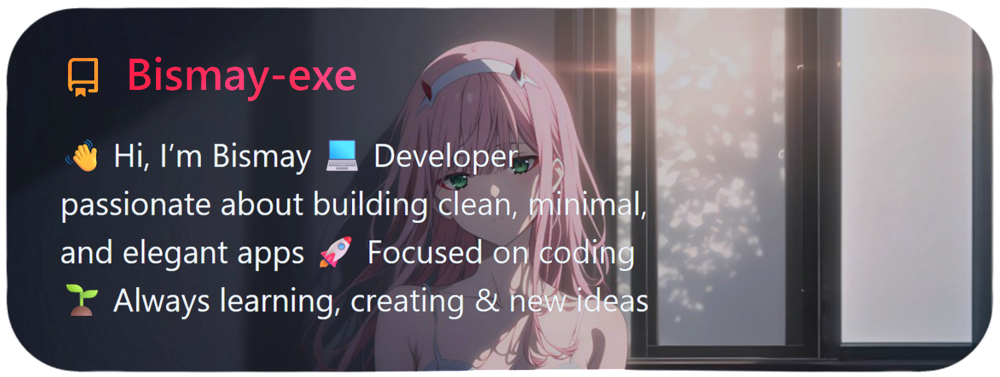
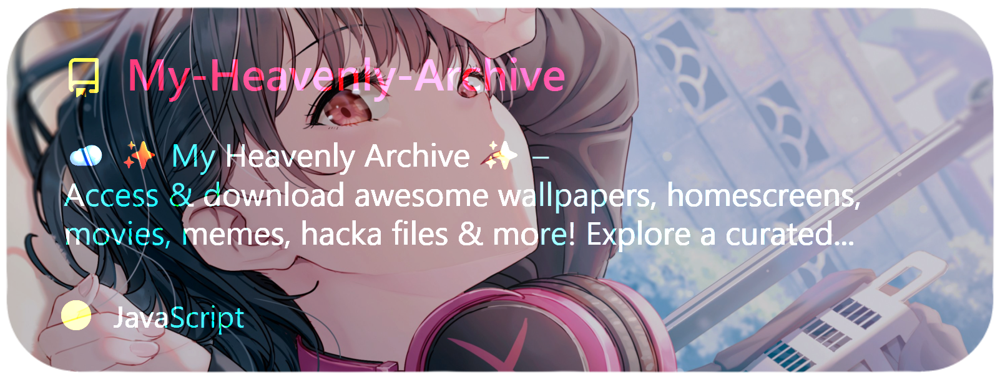

<!-- Banner -->


<p align="center">
  
</p>

---

## 👾 Who Am I?  

<p align="center">
  
</p>

<p align="center">
  
  
  
</p>

---

## 🌐 Connect with me

<p align="center">
  <a href="https://github.com/Bismay-exe" target="_blank">
    
  </a>

  <a href="https://instagram.com/bismay.exe" target="_blank">
    
  </a>

  <a href="https://t.me/bismay_exe" target="_blank">
    
  </a>

  <a href="https://discord.com" target="_blank">
    
  </a>
</p>

<p align="center">
  <a href="https://youtube.com" target="_blank">
    
  </a>

  <a href="https://linkedin.com" target="_blank">
    
  </a>

  <a href="https://threads.net/@bismay.exe" target="_blank">
    
  </a>

  <a href="https://t.me/BismaysInventory" target="_blank">
    
  </a>
</p>


---

## 💎 Some Of My Projects

<p align="center">
  <a href="https://github.com/Bismay-exe/Bismay-exe">
    
  </a>
  <a href="https://github.com/Bismay-exe/Beautiful-Notes">
    
  </a>
  <a href="https://github.com/Bismay-exe/My-Heavenly-Archive">
    
  </a>
  <a href="https://github.com/Bismay-exe/Mechanical-Calculator">
    
  </a>
</p>

---

## ✨ Featured Projects

<p align="center">
  <table>
    <tr>
      <!-- Beautiful Notes -->
      <td align="center" width="33%">
        <h3>📝 Beautiful Notes</h3>
        <p>Take Beautiful Notes with Glassmorphism UI, Smart Search, Sorting, and Fullscreen</p>
        <a href="https://bismay-exe.github.io/Beautiful-Notes/">
          
        </a><br><br>
        
      </td>
      <!-- Heavenly Archive -->
      <td align="center" width="33%">
        <h3>✨ Heavenly Archive</h3>
        <p>Glassmorphism Media Gallery with Filters, Sorting, Backgrounds, and Lightbox</p>
        <a href="https://bismay-exe.github.io/Heavenly-Archive/">
          
        </a><br><br>
        
      </td>
      <!-- Mechanical Calculator -->
      <td align="center" width="33%">
        <h3>🖩 Mechanical Calculator</h3>
        <p>All-in-One Calculator — Standard · RPN · Programmer · Converter · Themes</p>
        <a href="https://bismay-exe.github.io/Mechanical-Calculator/">
          
        </a><br><br>
        
      </td>
      <!-- Crypto converter -->
      <td align="center" width="33%">
        <h3>💱 Crypto converter</h3>
        <p>Realtime BTC, ETH & LTC ↔ INR, USD, EUR | Sleek Glassmorphic UI ⚡</p>
        <a href="https://bismay-exe.github.io/Crypto-converter/">
          
        </a><br><br>
        
      </td>
    </tr>
  </table>
</p>

---

## 🛠️ Tech Stack  

<p align="center">
  
</p>

---

## 📊 GitHub Stats


<a href="https://git.io/streak-stats"></a>


<table>
  <tr>
    <td>
      🍩 Languages Donut:
    </td>
  </tr>
  <tr>
    <td>
      
    </td>
  </tr>
</table>

<table>
  <tr>
    <td>
      🧠 Languages by Repo:
    </td>
  </tr>
  <tr>
    <td>
      
    </td>
  </tr>
</table>

<table>
  <tr>
    <td>
      🔤 Languages by Commits:
    </td>
  </tr>
  <tr>
    <td>
      
    </td>
  </tr>
</table>

<table>
  <tr>
    <td>
      🕸️ Contribution Radar:
    </td>
  </tr>
  <tr>
    <td>
      
    </td>
  </tr>
</table>

<table>
  <tr>
    <td>
      ⏳ Productive Time:
    </td>
  </tr>
  <tr>
    <td>
      
    </td>
  </tr>
</table>


---

## ASCII Banner

Font: `shadow`
Message: `Open Source ❤️`
```text
__________.__                                                            
\______   \__| ______ _____ _____  ___.__.           ____ ___  ___ ____  
 |    |  _/  |/  ___//     \\__  \<   |  |  ______ _/ __ \\  \/  // __ \ 
 |    |   \  |\___ \|  Y Y  \/ __ \\___  | /_____/ \  ___/ >    <\  ___/ 
 |______  /__/____  >__|_|  (____  / ____|          \___  >__/\_ \\___  >
        \/        \/      \/     \/\/                   \/      \/    \/ 
```

---

## 🐍 Contribution Snake

<p align="center">
<picture>
  <source media="(prefers-color-scheme: dark)" 
          srcset="https://raw.githubusercontent.com/Bismay-exe/Bismay-exe/output/snake-dark.svg">
  <source media="(prefers-color-scheme: light)" 
          srcset="https://raw.githubusercontent.com/Bismay-exe/Bismay-exe/output/snake.svg">
  
</picture>
</p>


---

## 📈 Contribution Graph

[](https://github.com/ashutosh00710/github-readme-activity-graph)


---

## 📊 GitHub Metrics Dashboard

<p align="center">
  
  
</p>

---

## ✨ Quote / Motto  

<p align="center">
  <br>
  <b>“Code is like art 🎨 — every line you write shapes the future you’re building.”</b>
</p>
<!-- CARDS-START -->
## 📦 My Projects

<p align="center">

</p>

<p align="center">

</p>

<p align="center">

</p>

<!-- CARDS-END -->
