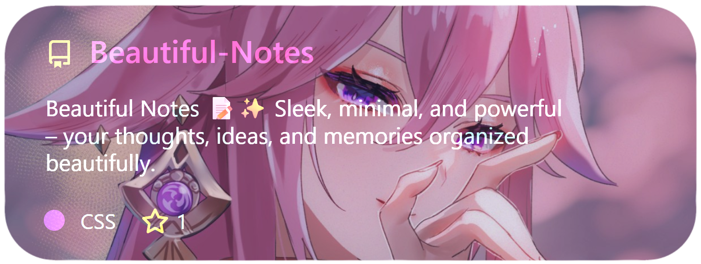
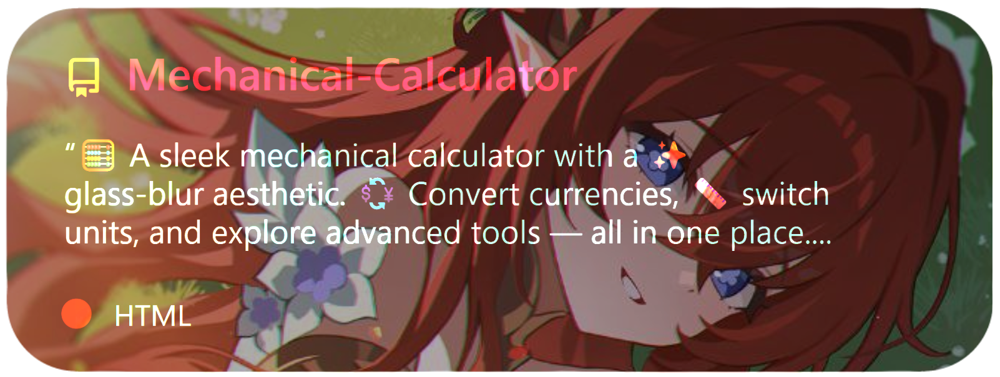

<!-- Banner -->


<p align="center">
  
</p>

---

## 👾 Who Am I?  

<p align="center">
  
</p>

<p align="center">
  
  
  
</p>

---

## 🌐 Connect with me

<p align="center">
  <a href="https://github.com/Bismay-exe" target="_blank">
    
  </a>

  <a href="https://instagram.com/bismay.exe" target="_blank">
    
  </a>

  <a href="https://t.me/bismay_exe" target="_blank">
    
  </a>

  <a href="https://discord.com" target="_blank">
    
  </a>
</p>

<p align="center">
  <a href="https://youtube.com" target="_blank">
    
  </a>

  <a href="https://linkedin.com" target="_blank">
    
  </a>

  <a href="https://threads.net/@bismay.exe" target="_blank">
    
  </a>

  <a href="https://t.me/BismaysInventory" target="_blank">
    
  </a>
</p>


---

## 💎 Some Of My Projects

<p align="center">
  <a href="https://github.com/Bismay-exe/Bismay-exe">
    
  </a>
  <a href="https://github.com/Bismay-exe/Beautiful-Notes">
    
  </a>
  <a href="https://github.com/Bismay-exe/My-Heavenly-Archive">
    
  </a>
  <a href="https://github.com/Bismay-exe/Mechanical-Calculator">
    
  </a>
</p>

---

## ✨ Featured Projects

<p align="center">
  <table>
    <tr>
      <!-- Beautiful Notes -->
      <td align="center" width="33%">
        <h3>📝 Beautiful Notes</h3>
        <p>Take Beautiful Notes with Glassmorphism UI, Smart Search, Sorting, and Fullscreen</p>
        <a href="https://bismay-exe.github.io/Beautiful-Notes/">
          
        </a><br><br>
        
      </td>
      <!-- Heavenly Archive -->
      <td align="center" width="33%">
        <h3>✨ Heavenly Archive</h3>
        <p>Glassmorphism Media Gallery with Filters, Sorting, Backgrounds, and Lightbox</p>
        <a href="https://bismay-exe.github.io/Heavenly-Archive/">
          
        </a><br><br>
        
      </td>
      <!-- Mechanical Calculator -->
      <td align="center" width="33%">
        <h3>🖩 Mechanical Calculator</h3>
        <p>All-in-One Calculator — Standard · RPN · Programmer · Converter · Themes</p>
        <a href="https://bismay-exe.github.io/Mechanical-Calculator/">
          
        </a><br><br>
        
      </td>
    </tr>
  </table>
</p>

---

## 🛠️ Tech Stack  

<p align="center">
  
</p>

---

## 📊 GitHub Stats (Liquid Glass)  

<p align="center">
  
  
</p>
<p align="center">
  
</p>
<p align="center">
  
</p>


---

## ASCII Banner

<!--ascii-start-->
Font: `shadow`
Message: `Eat, Sleep, Commit, Repeat 🔁`
```text
 ____|       |       ___|  |                  
 __|    _` | __|   \___ \  |  _ \  _ \ __ \   
 |     (   | |           | |  __/  __/ |   |  
_____|\__,_|\__| ) _____/ _|\___|\___| .__/ ) 
                /                     _|   /  
  ___|                          _) |       _ \                        |   
 |      _ \  __ `__ \  __ `__ \  | __|    |   |  _ \ __ \   _ \  _` | __| 
 |     (   | |   |   | |   |   | | |      __ <   __/ |   |  __/ (   | |   
\____|\___/ _|  _|  _|_|  _|  _|_|\__| ) _| \_\\___| .__/ \___|\__,_|\__| 
                                      /             _|                    
  `  <  
  \/\ | 
  __` | 
\____/  
        
```
<!--ascii-end-->

---

## 🐍 Contribution Snake  

<p align="center">
  
</p>

---

## 📊 GitHub Metrics Dashboard

<p align="center">
  
  
</p>

---

## ✨ Quote / Motto  

<p align="center">
  <br>
  <b>“Code is like art 🎨 — every line you write shapes the future you’re building.”</b>
</p>
<!-- CARDS-START -->
## 📦 My Projects

<p align="center">

</p>

<p align="center">

</p>

<p align="center">

</p>

<!-- CARDS-END -->
